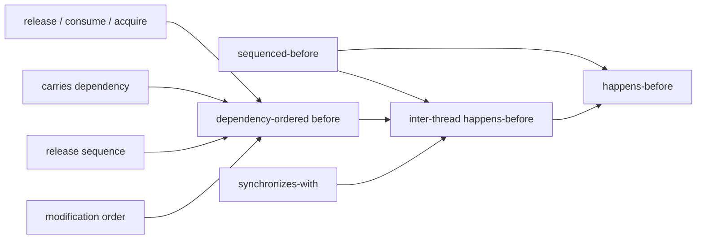

## 直观解释

relaxed 只保证 atomicity。

acquire 保证 op 之后的 r/w 不会被 reorder 到 op 之前；release 保证 op 之前的 r/w 不会被 reorder 到 op 之后。

seq-cst 保证 op 前后的 r/w 都不会被 reorder 穿过 op。

```c++
atomic<bool> f1 = false, f2 = false;
// 按照标准，store 和 load 可以被 reorder。
f1.store(true, memory_order_release);
if (!f2.load(memory_order_acquire))
  // ...
```

seq-cst 和 act-rel 的区别在于，seq-cst 包含了 act-rel，此外在所有的 seq-cst 的 op 上建立了一个 single total modification order，顺序在所有的线程观察下都一样。

## Formal Description

Memory model 中的各种定义的描述比较冗长，其核心在于引出 *happens-before* 和 *visible* 这两个定义。定义太多可能令人混乱，总结关系图如下。



### Release / Acquire / Consume

Atomic store with `memory_order_release` or stronger is a **release** operation. The `unlock()` operation on a `Mutex` is also a release operation. Release  store 不允许编译器和 CPU 将本线程（之前）的 load / store 指令重排到本次 load 之后。

Atomic load with `memory_order_acquire` or stronger is an **acquire** operation. The `lock()` operation on a `Mutex` is also an acquire operation. Acquire load 不允许编译器和 CPU 将本线程（之后）的 load / store 指令重排到本次 load 之前。

Atomic load with `memory_order_consume` or stronger is a **consume** operation. Consume load 不允许编译器和 CPU 将本线程（之后）的**依赖本次 load 的** load / store 指令重排到本次 load 之前。对于何为“依赖”，请参见 subsection *carries dependency*。

### Sequenced-before

同一线程中，如果 evaluation A **sequenced-before** evalution B，那么 evaluation A 在 evaluation B 开始前结束。详细定义比较漫长，具体参见 [evaluation order 的定义](https://en.cppreference.com/w/cpp/language/eval_order)。

### Carries dependency

同一线程中，如果以下任一条件为真：

- The value of A is used as an operand of B, **except** (即 B 读 A 计算结果)
  1. if B is a call to `std::kill_dependency`,
  2. if A is the left operand of the built-in `&&`, `||`, `?:`, or `,` operators.
- A write to a scalar object M, B read from M (即 B 读 A 写的内容).
- A carries dependency into evaluation X, and X carries dependency into B (即传递关系).

那么 evaluation A (that is sequenced-before evaluation B) **carries a dependency into** B (B **depends on** A)。

这一定义直观上很容易理解，但却非常重要，定义了何为”依赖关系“。

### Modification Order

对一个 atomic variable 所有的修改，其 **modification order** 是全序的。

所有的原子操作满足 4 个 requirements：write-write coherence，read-read coherence，read-write coherence，和 write-read coherence。这又涉及了 *happens-before* 的概念，此时可以暂时忽略这 4 个 requirements。

### Release-sequence

在 atomic object M 上进行 *release operation* A 之后，满足以下性质的 M 的 modification order 的**最长连续子序列**

1. Writes performed by the same thread (同线程的写操作)
2. Atomic read-modify-write operations by any thread (任意线程的 RMW 操作)

被称为 **release sequence headed by** A。

### Dependency-ordered before

多个线程间，如果以下任一条件为真：

1. A performs a *release operation* on atomic M, 另一线程上, B performs a *consume operation* on M, and B reads a value written by A.
2. A is dependency-ordered before X and X carries a dependency into B (X 把关系传递到同一线程中的 B).

那么 evaluation A **dependency-ordered before** evaluation B。

可以粗略理解为，dependency-ordered before 是 carries dependency 的多线程版本，通过 release / consume 这一组操作建立了一个“依赖关系”。

值得注意的是，C++20 将条件 1 中 *B reads a value written by A* 拓展为 *B reads a value written by any part of the release sequence headed by A*。

### Synchronizes-with

根据 [working draft N3337](http://www.open-std.org/jtc1/sc22/wg21/docs/papers/2012/n3337.pdf)：

> An atomic operation A that performs a release operation on an atomic object M **synchronizes with** an atomic operation B that performs an acquire operation on M and takes its value from any side effect in the release sequence headed by A.

如果说 release / consume 建立了一个 *dependency-ordered before* 关系，那么 release / acquire 建立了一个 *synchronizes-with* 关系。

### Inter-thread happens-before

多个线程间，如果以下任一条件为真：

1. A *synchronizes-with* B（一组 release / acquire 操作）
2. A is *dependency-ordered before* B（一组 release / consume 操作）
3. A *synchronizes-with* X, and X is *sequenced-before* B
4. A is *sequenced-before* X, and X *inter-thread happens-before* B
5. A *inter-thread happens-before* X, and X *inter-thread happens-before* B（三线程传递关系）

那么 evaluation A **inter-thread happens before** evaluation B。

条件 1 和 2 分别对应 release / acquire 和 release / consume 很容易理解。条件 5 表示 inter-thread happens-before 的传递性，也容易理解。

条件 4 是指：A sequenced-before X，X inter-thread happens-before B，那么 A inter-thread happens-before B。但是条件 3 比较复杂，**并不是**简单把条件 4 反过来变成：

>  *A is inter-thread happens-before X and X sequenced-before B*

而是把条件限制成了 *A synchronizes-with X*。**此处存疑，但我个人的理解是**：*因为 consume load 不能保证 B 在运行时不会重排到 X 之前（sequenced-before 应该是一个编译期的保证，我不太相信编译器能廉价地影响 [CPU 乱序执行](https://en.wikipedia.org/wiki/Memory_ordering)）*。

### Happens-before

**Happens-before** 有两种情况：

1. 同一线程，A is *sequenced-before* B，
2. 不同线程，A *inter-thread happens before* B。

### Visible Side-effects

如果以下条件均为真：

1. A *happens-before* B
2. no other side effect X to M, where A *happens-before* X and X *happens-before* B（中间无阻拦）

那么，**side-effect** A on scalar M (a write) is **visible** with respect to value computation B on M (a read)。

# References

- [C++ Reference: Memory Order](https://en.cppreference.com/w/cpp/atomic/memory_order)
- [The Synchronizes-with Relation](https://preshing.com/20130823/the-synchronizes-with-relation/)

