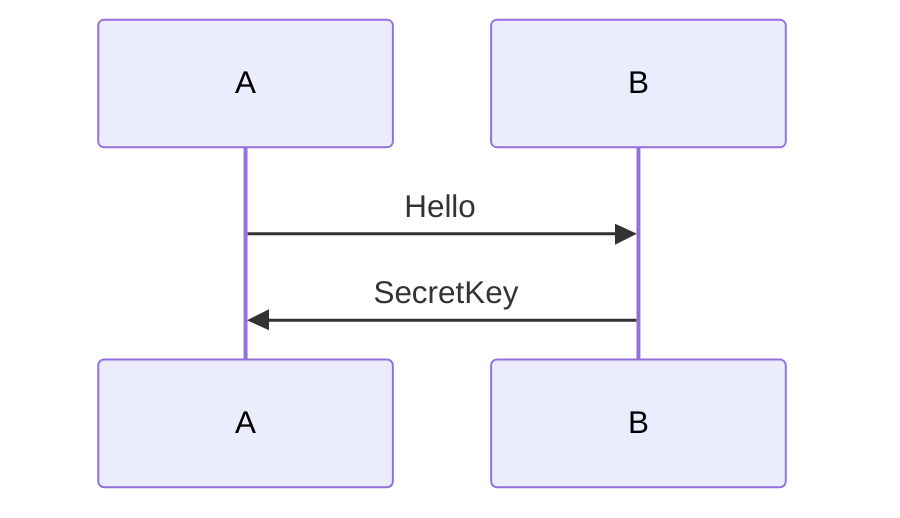
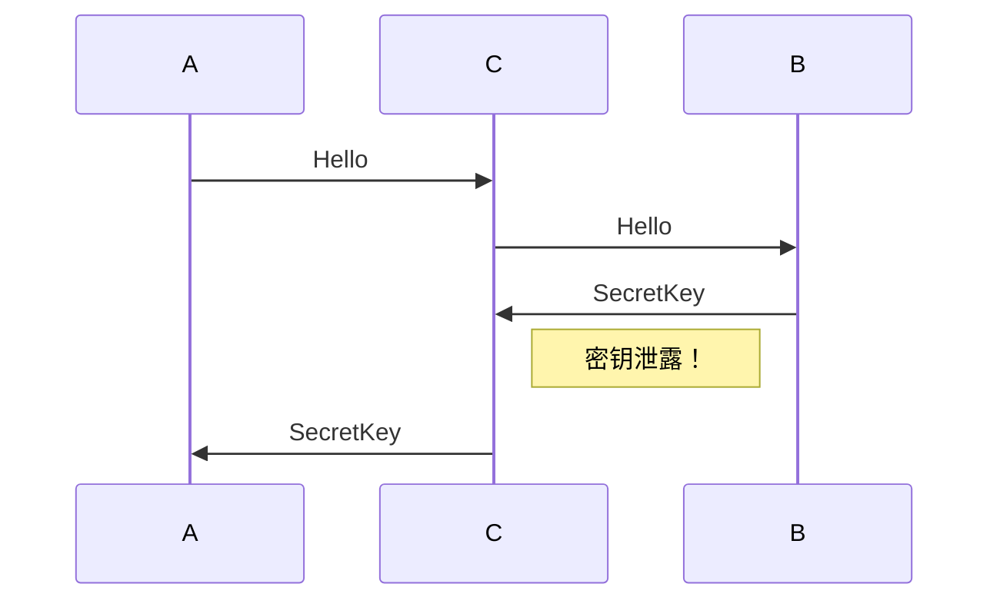
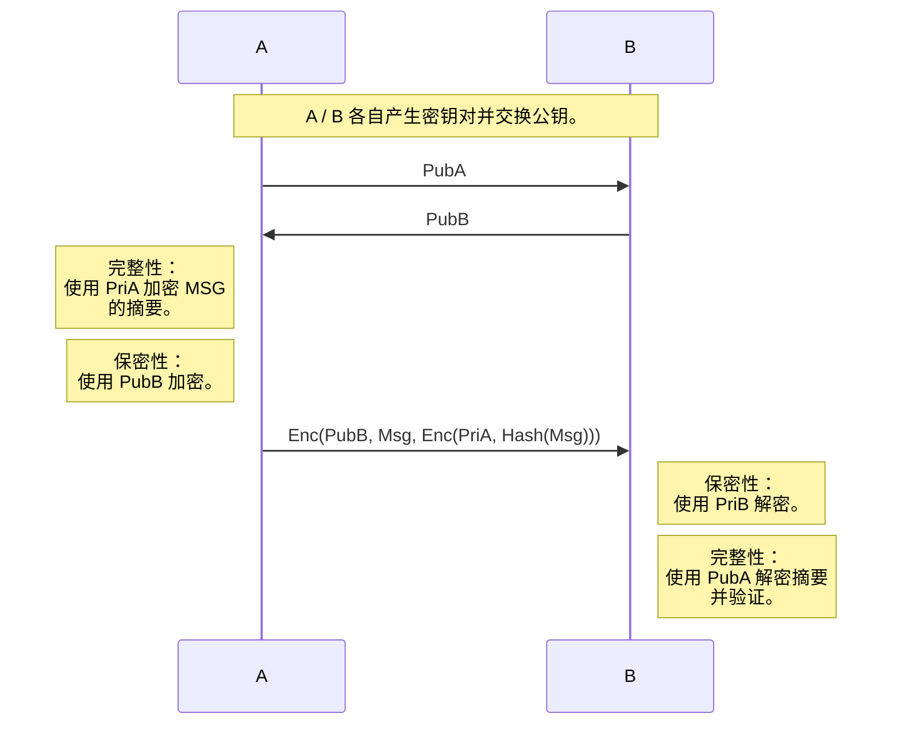
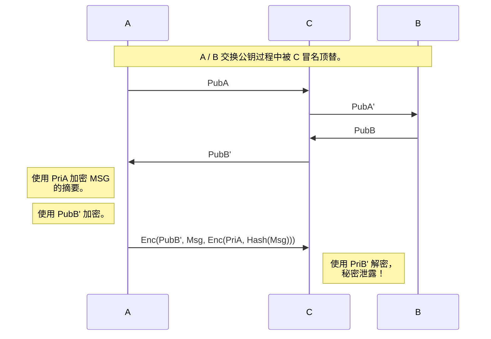
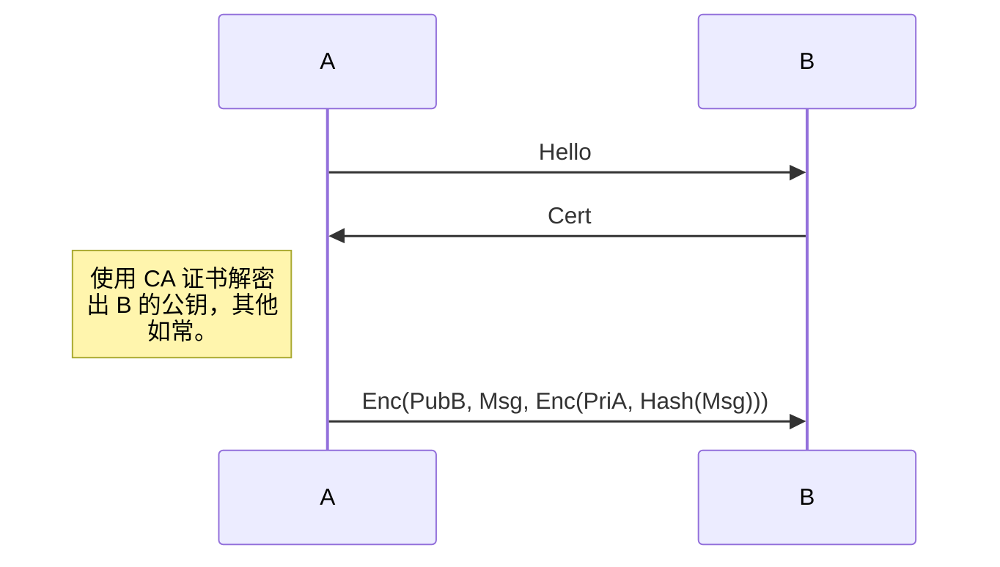
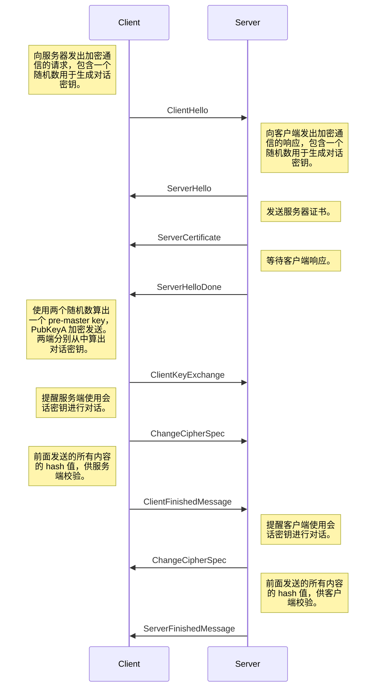

本文简单介绍数字证书和 SSL / TLS 背后的思想，不涉及密码学算法本身。

## 数字证书

通信安全的 3 个目标：

1. 保密性（不被窃听）
2. 完整性（不被冒名或篡改）
3. 可用性

### 对称加密

最原始想法是使用一个密钥担负加密/解密的任务。

对称加密传递密钥的过程可能被窃听，导致密钥泄露。这使得密钥的交换必须通过可信任的实体面对面进行，这显然是低效的。

### 非对称加密

非对称加密使用两个密钥，一个是 public key，一个是 private key。通过一个特殊的数学算法，使得数据的加密和解密使用不同的密钥。因为用的是不同的密钥，所以称为非对称加密。非对称加密最著名的是 RSA 算法。以现有的算法和计算机算力，没有办法从一个密钥算出另一个密钥。

非对称加密的好处在于，A 可以保留 private key，通过网络传递 public key。即使 C 拦截了 public key，因为没有 private  key，C 还是没有办法完成信息的破解。因此可以直接通过网络传递 public key。

由于使用 PubB 加密传输内容，没有 PriB 的 C 不可能解密内容，因此保证了保密性。

但是 C 可能窃听了 PubB，可以模仿 A 去使用 PubB 加密发送内容，无法保证完整性。所以用 PriA 加密消息的哈希值，C 没有 PriA 无法模仿 A 进行签名（此处重放攻击仍可成立）。

### CA

虽然 public key 的泄露不会造成危险，但是可能出现 C 拦截并篡改 public key 的情况，中间人攻击依旧存在。

于是 public key 的交换必须通过可信任实体面对面进行，又再次折返到了对称加密面对的问题之上。为了解决这一问题，CA（Certificate Authority）出现了。CA 通常是具有强大经济实力，复杂社会关系，与良好信用背书的社会团体，你只能选择相信他们。

B **预先**把自己的 public key 交给 CA，CA 用自己的 private key 进行加密，制成 B 的**数字证书**。随后 B 向 A 传递数字证书。A 收到后，通过 CA 发布的 **CA 证书**（包含了 CA 的 public key）来解密 B 的数字证书，从而获得 B 的 public key。

那么 A 如何确保 CA 证书不被劫持呢？C 完全可以把一个假的 CA 证书发给A，进而欺骗 A。CA 通过自己强大的关系与实力，把自己的 CA 证书集成在了浏览器和操作系统里面。A拿到浏览器或者操作系统的时候，已经有了 CA 证书，没有必要通过网络获取，自然也不存在劫持的问题（*所以要小心提防盗版操作系统和软件*）。

## SSL / TLS

基于非对称加密和数字证书的原理，Netscape 公司设计了 SSL 和 TLS 这两个加密通信协议。SSL / TLS 的基本过程如下：

1. 客户端向服务端索要并验证公钥，
2. 协商生成对话密钥，
3. 使用对话密钥进行加密通信。

### 握手过程

TLS 的协商过程比较复杂，下面是一个简化版的过程，省略了一些可选的特性。具体内容请参考 RFC。

## 参考

- [浅谈SSL/TLS工作原理](https://zhuanlan.zhihu.com/p/36981565)
- [SSL/TLS in Detail](https://docs.microsoft.com/en-us/previous-versions/windows/it-pro/windows-server-2003/cc785811(v=ws.10)?redirectedfrom=MSDN)
- [Mermaid Sequence Diagram](https://mermaid-js.github.io/mermaid/#/sequenceDiagram)
- [The Transport Layer Security (TLS) Protocol Version 1.3](https://tools.ietf.org/html/rfc8446)